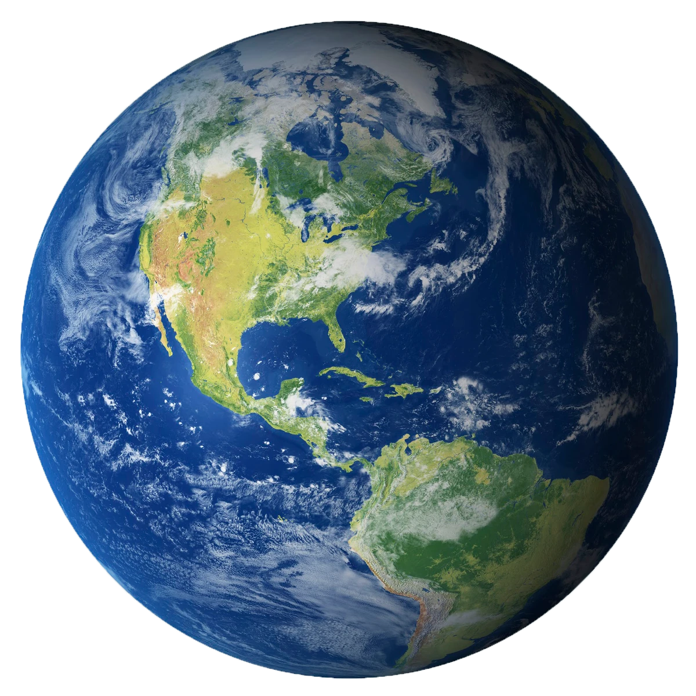

# Sistema Solar

El **Sol** es la estrella central de nuestro sistema solar.

## Tierra

La **Tierra** es nuestro hogar y el único planeta conocido que alberga vida.

### Luna

La **Luna** es el satélite natural de la Tierra.

